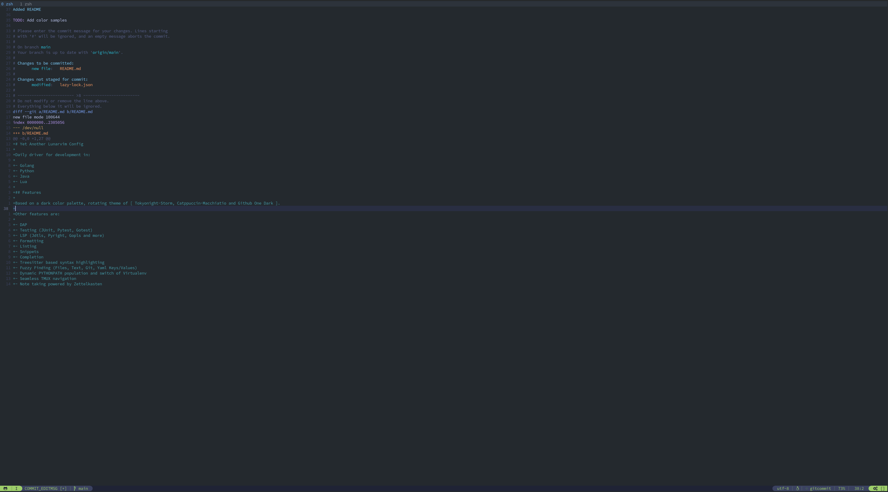
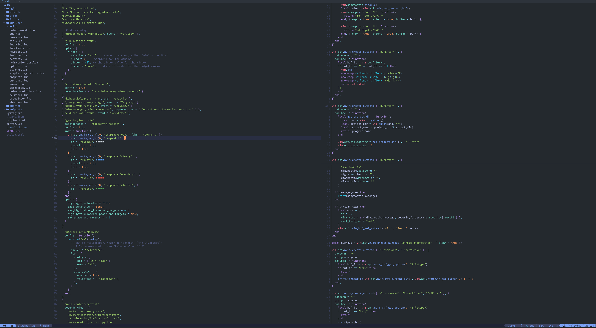

# Yet Another Lunarvim Config

Daily driver for development in:

- Golang
- Python
- Java
- Lua

## Features

Based on a dark color palette, rotating theme of ***[Tokyonight-Storm, Catppuccin-Macchiatio and Github One Dark]***.

Other features are:

- DAP
- Testing (JUnit, Pytest, Gotest)
- LSP (Jdtls, Pyright, Gopls and more)
- Formatting
- Linting
- Snippets
- Completion
- Treesitter based syntax highlighting
- Fuzzy Finding (Files, Text, Git, Yaml Keys/Values)
- Dynamic PYTHONPATH population and switch of Virtualenv
- Seamless TMUX navigation
- Git integration
- Note taking powered by Zettelkasten

## Screenshots

*Splashscreen*

*Git Commit*

*Live Grep*

*Splits*
